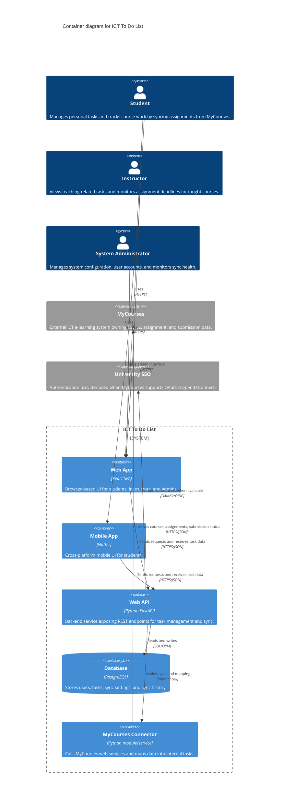

ICT To Do List is a task management system for the ICT e learning environment. It supports both a web based application and a mobile application. The purpose is to help students track personal tasks and automatically track course work by syncing assignments and submission status from MyCourses. A user can create tasks manually, and the system can also create tasks from MyCourses assignments. The user can view tasks, update task details, delete tasks, and mark tasks as done. Each task has a title, optional description, due date, status, and a source flag that indicates whether the task is manual or imported from MyCourses. Imported tasks also store the MyCourses assignment ID so the system can update the correct task during future sync and avoid duplicates.
The system has three primary user roles. Student is the main user who manages the task list, views assignments, and tracks submission status. Instructor may use the system to view their own teaching related tasks and monitor a high level view of assignment deadlines for the courses they teach, but the instructor does not see student private tasks. System Administrator manages system configuration, supports user accounts, and monitors sync health. The administrator uses a separate admin interface provided by the web application or a dedicated admin screen.
The system interacts with external systems. MyCourses is an external ICT e learning system that owns course, assignment, and submission data. ICT To Do List must connect to MyCourses to retrieve assignment lists and submission status for the authenticated user. MyCourses exposes web services that return JSON payloads. The integration must support at least these operations. Retrieve the list of active courses for the user. Retrieve assignments for a selected course including assignment title, due date, and assignment ID. Retrieve submission status for the user for each assignment, including submitted or not submitted and submission timestamp when available. ICT To Do List treats MyCourses as the source of truth for imported assignments and submission status.
ICT To Do List includes these internal containers and technology decisions. Web App is a browser based user interface implemented as a single page application using React. Mobile App is a cross platform mobile application implemented using Flutter so the same codebase can support both iOS and Android. Web API is the backend service implemented using Python FastAPI and exposes REST endpoints that accept and return JSON. Database is PostgreSQL, used to store user profiles, tasks, sync settings, and sync history. MyCourses Connector is an integration module running within the backend deployment, implemented as a separate service module that calls MyCourses web services, parses JSON responses, and maps external data into internal task records. All client requests from Web App and Mobile App go to the Web API over HTTPS using JSON. The Web API reads and writes data in PostgreSQL using SQL through an ORM such as SQLAlchemy. The Web API calls the MyCourses Connector over an internal interface, such as a direct function call or an internal HTTP call if deployed as a separate service. The MyCourses Connector communicates with MyCourses over HTTPS and exchanges JSON with the MyCourses web services. Authentication uses university single sign on when available. If MyCourses supports OAuth2 or OpenID Connect, ICT To Do List uses that mechanism. If not, ICT To Do List uses its own account system and stores only the minimum link needed to call MyCourses on behalf of the user.
The main user flows are as follows. A student signs in to ICT To Do List using the Web App or Mobile App. After sign in, the client requests the current task list from the Web API. The student can create a manual task by sending task details to the Web API, which validates the input and stores the task in the Database. The student can edit or delete a task using the same pattern. The student can mark a task as done, which updates the task status in the Database. The student can start a MyCourses sync from the client. The client sends a sync request to the Web API. The Web API calls the MyCourses Connector, which calls MyCourses web services to retrieve courses, assignments, and submission status for that user. The connector returns the mapped result to the Web API. The Web API creates new imported tasks for new assignments and updates existing imported tasks when the assignment due date or submission status changes. When a MyCourses assignment is marked as submitted, the related imported task can be marked as done automatically or marked with a submitted status, depending on the design choice. The user then refreshes the task list and sees updated items.
The system has key rules that guide the architecture. Each user can access only their own task list. Student tasks are private and are not visible to instructors or other students. Imported tasks must be linked to the MyCourses assignment ID to support update and deduplication. Synchronisation must not delete manual tasks. Synchronisation failures must not corrupt existing tasks. The system must handle MyCourses downtime by returning a clear error to the user and recording the failure in sync history. All network communication must use HTTPS. The system should store only the minimum MyCourses data needed to support the task view, such as course name, assignment title, due date, and submission status. The system should keep a sync log with timestamp, result, and error message for troubleshooting. The admin role can view sync health and manage system wide settings such as MyCourses endpoint configuration and default sync frequency.
For C4 Component level within the Web API, the internal design can be decomposed into major components with clear responsibilities. Authentication and Authorization Component handles login, token validation, and access control checks. Task Management Component handles CRUD operations for manual and imported tasks. MyCourses Sync Orchestrator Component manages the sync workflow and decides when to call external services and how to update tasks. MyCourses Client Component calls MyCourses web services and handles HTTPS requests and JSON parsing, and may be implemented inside the MyCourses Connector. Mapping Component converts MyCourses assignment and submission data into the internal task model. Sync History Component records sync outcomes and provides data for admin monitoring. Data Access Component provides repository functions for PostgreSQL access and ensures that all updates are done in controlled transactions.



```mermaid
C4Component
title Component diagram for ICT To Do List - Web API

Person(student, "Student", "Manages personal tasks and tracks course work by syncing assignments from MyCourses.")
Person(instructor, "Instructor", "Views teaching-related tasks and monitors assignment deadlines for taught courses.")
Person(admin, "System Administrator", "Manages system configuration, user accounts, and monitors sync health.")

Container(webApp, "Web App", "React SPA", "Browser-based UI for students, instructors, and admins.")
Container(mobileApp, "Mobile App", "Flutter", "Cross-platform mobile UI for students.")
ContainerDb(database, "Database", "PostgreSQL", "Stores users, tasks, sync settings, and sync history.")

System_Ext(mycourses, "MyCourses", "External ICT e-learning system that owns course, assignment, and submission data.")
System_Ext(sso, "University SSO", "Authentication provider used when MyCourses supports OAuth2/OpenID Connect.")

Container_Boundary(webApi, "Web API") {
    Component(auth, "Authentication & Authorization", "FastAPI component", "Handles login, token validation, and access control.")
    Component(taskMgmt, "Task Management", "FastAPI component", "CRUD operations for manual and imported tasks.")
    Component(syncOrch, "MyCourses Sync Orchestrator", "FastAPI component", "Manages sync workflow and task updates.")
    Component(mycoursesClient, "MyCourses Client", "HTTP client", "Calls MyCourses web services and parses JSON.")
    Component(mapping, "Mapping", "Mapper", "Maps MyCourses data into internal task model.")
    Component(syncHistory, "Sync History", "FastAPI component", "Records sync outcomes for admin monitoring.")
    Component(dataAccess, "Data Access", "Repository/ORM", "Controlled database access using SQLAlchemy.")
}

Rel(student, webApp, "Uses", "HTTPS")
Rel(student, mobileApp, "Uses", "HTTPS")
Rel(instructor, webApp, "Uses", "HTTPS")
Rel(admin, webApp, "Uses admin interface", "HTTPS")

Rel(webApp, taskMgmt, "Manages tasks via", "HTTPS/JSON")
Rel(webApp, syncOrch, "Starts sync via", "HTTPS/JSON")
Rel(webApp, auth, "Authenticates via", "HTTPS/JSON")
Rel(mobileApp, taskMgmt, "Manages tasks via", "HTTPS/JSON")
Rel(mobileApp, syncOrch, "Starts sync via", "HTTPS/JSON")
Rel(mobileApp, auth, "Authenticates via", "HTTPS/JSON")

Rel(taskMgmt, dataAccess, "Reads/writes tasks", "SQL/ORM")
Rel(syncOrch, mycoursesClient, "Retrieves courses/assignments/submissions", "HTTPS/JSON")
Rel(syncOrch, mapping, "Maps external data", "In-process")
Rel(syncOrch, dataAccess, "Creates/updates tasks", "SQL/ORM")
Rel(syncOrch, syncHistory, "Records sync results", "In-process")
Rel(syncHistory, dataAccess, "Stores sync logs", "SQL/ORM")

Rel(auth, sso, "Authenticates users when available", "OAuth2/OIDC")
Rel(mycoursesClient, mycourses, "Calls MyCourses APIs", "HTTPS/JSON")
Rel(dataAccess, database, "Reads and writes", "SQL/ORM")

UpdateLayoutConfig($c4ShapeInRow="2")
